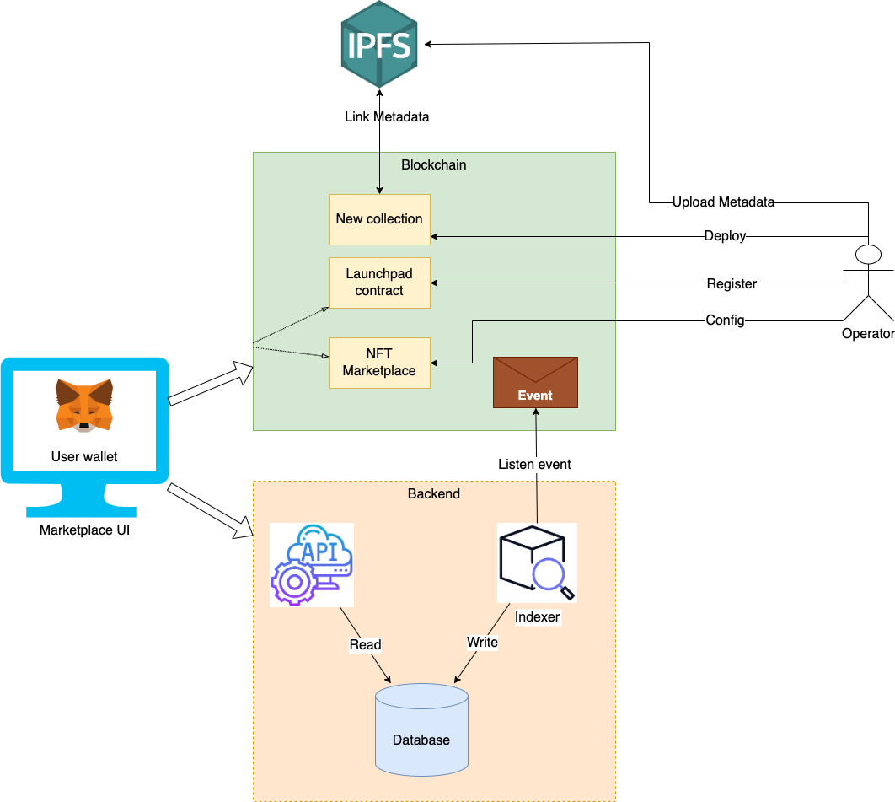

# NFT Marketplace

This is essentials smart contract of a NFT marketplace.

## Features:
- Launchpad
- Listing/Buy NFTs
- Auction/Bidding NFTs
- Offer unlist NFTs

## Architecture



## Prerequisites:
- Node.js
- Yarn or npm
- Metamask (or any other compatible wallet)
- Solidity (for smart contract compilation)
- IPFS or Arweave (optional for decentralized storage)

## Command:
```sh
git clone https://github.com/AlexZuy/NFT-marketplace.git
cd nft-marketplace
```
Install dependencies:

```sh
npm install
```

### Configu re Environment:

Create a .env file based on .env.example and add your private keys, RPC endpoints, and other configurations.

### Deploy Smart Contracts:

Ensure you have the necessary funds in your wallet and a configured RPC endpoint. Run:

```sh
npx hardhat deploy scripts/deployLaunchpad.ts 

npx hardhat deploy scripts/deployMarketplace.ts 
```

### Contributing
Contributions are welcome! Please submit a pull request or open an issue to discuss any changes.

### Contact
For any questions or support, feel free to contact: 
Email: vukhuongduy2305@gmail.com

GitHub: AlexZuy
